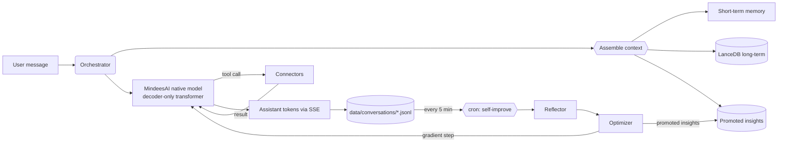

<div align="center">

<a href="https://github.com/aashir-athar/mindeesai">
  <picture>
    <source media="(prefers-color-scheme: dark)" srcset="assets/banner-dark.png">
    <source media="(prefers-color-scheme: light)" srcset="assets/banner-light.png">
    
  </picture>
</a>

# MindeesAI

### A native, self-training open-source AI — the model trains itself every five minutes.

##### DeepSeek-V3-class architecture: MoE · MLA · MTP · GRPO · Reasoning Mode · Constitutional AI · Speculative Decoding · Eval-gated Continual Learning

<a href="https://github.com/aashir-athar/mindeesai/stargazers"></a>
<a href="https://github.com/aashir-athar/mindeesai/network/members"></a>
<a href="https://github.com/aashir-athar/mindeesai/issues"></a>
<a href="LICENSE"></a>
<a href="https://github.com/aashir-athar/mindeesai/commits/main"></a>


<a href="https://vercel.com/new/clone?repository-url=https%3A%2F%2Fgithub.com%2Faashir-athar%2Fmindeesai&project-name=mindeesai&repository-name=mindeesai&env=CRON_SECRET,TAVILY_API_KEY,FIRECRAWL_API_KEY&envDescription=CRON_SECRET%20is%20required%20(generate%20with%20%60openssl%20rand%20-hex%2032%60).%20TAVILY%20and%20FIRECRAWL%20keys%20are%20optional%20but%20enable%20the%20web-search%20and%20web-crawl%20connectors%20(both%20have%20free%20tiers).&envLink=https%3A%2F%2Fgithub.com%2Faashir-athar%2Fmindeesai%2Fblob%2Fmain%2F.env.example&stores=%5B%7B%22type%22%3A%22blob%22%7D%5D"></a>

<br/>
<br/>

<a href="https://vercel.com/new/clone?repository-url=https%3A%2F%2Fgithub.com%2Faashir-athar%2Fmindeesai&project-name=mindeesai&repository-name=mindeesai&env=CRON_SECRET,TAVILY_API_KEY,FIRECRAWL_API_KEY&envDescription=CRON_SECRET%20is%20required%20(generate%20with%20%60openssl%20rand%20-hex%2032%60).%20TAVILY%20and%20FIRECRAWL%20keys%20are%20optional%20but%20enable%20the%20web-search%20and%20web-crawl%20connectors%20(both%20have%20free%20tiers).&envLink=https%3A%2F%2Fgithub.com%2Faashir-athar%2Fmindeesai%2Fblob%2Fmain%2F.env.example&stores=%5B%7B%22type%22%3A%22blob%22%7D%5D"></a>

</div>

> **MindeesAI is a free, open-source language model that trains itself every five minutes — on its own conversations, with its own weights.** A DeepSeek-V3-class architecture: Mixture of Experts, Multi-head Latent Attention, Multi-Token Prediction, reasoning mode with hidden `<think>` blocks, Group Relative Policy Optimization (GRPO) RL, constitutional self-critique, speculative decoding, eval-gated training with rollback. Native transformer. Native BPE tokenizer. Native gradient-descent loop. No vendor. No subscription. No forgetting. The model gets measurably smarter the more you use it, and you can audit every change it makes to its own brain.

<div align="center">

<picture>
  <source media="(prefers-color-scheme: dark)" srcset="assets/screenshot-dark.png">
  
</picture>

| Landing | Chat canvas | Live training |
|:---:|:---:|:---:|
|  |  |  |

</div>

---

## Table of Contents

- [Why MindeesAI?](#why-mindeesai)
- [Built For](#built-for)
- [Features](#features)
- [Tech Stack](#tech-stack)
- [Architecture](#architecture)
- [Design Philosophy](#design-philosophy)
- [Getting Started](#getting-started)
- [Deploy to Vercel](#deploy-to-vercel)
- [Scripts](#scripts)
- [Roadmap](#roadmap)
- [Contributing](#contributing)
- [Contributors](#contributors)
- [Star History](#star-history)
- [FAQ](#faq)
- [Acknowledgments](#acknowledgments)
- [License](#license)

---

## Why MindeesAI?

Most open-source "AI" projects are thin wrappers around someone else's model — call `openai.chat.completions.create`, render the result. The moment that vendor changes pricing, deprecates a model, or rate-limits your account, your "product" stops working.

**MindeesAI is the model.** The decoder-only transformer architecture, the BPE tokenizer, the AdamW optimizer, the LoRA online-learning loop, the curriculum self-play, the DPO RLHF from thumb signals — all of it lives in this repository, written in TypeScript with optional WebGPU acceleration, with a Python pretraining path for the heavy lift. Inference happens locally. Training happens locally. You own the weights and you own the data.

Every five minutes, a cron job runs an actual gradient-descent step on the model's weights using your recent conversations as the training signal. The neural network you talked to ten minutes ago is not the neural network you're talking to now — and the diff is recorded in an append-only audit log you can review, replay, or roll back.

This is what **`self-training language model`**, **`continual learning AI`**, **`open-source LLM from scratch`**, **`LoRA online fine-tuning`**, and **`autonomous RAG with curriculum self-play`** actually look like when no vendor is in the loop.

## Built For

- **Engineers** who want to understand modern transformer architecture from the inside, with every kernel readable in TypeScript.
- **Researchers** who want a controlled environment to study online learning, continual fine-tuning, and self-supervised curriculum generation.
- **Founders** building AI products who want a non-vendor foundation that won't disappear in a pricing memo.
- **Privacy-first users** who want a chat AI that *physically cannot* exfiltrate their conversations to a third-party API.
- **Educators and students** learning how language models work — every layer is a single readable TypeScript file.

---

## Meet Mindees

The product is called **MindeesAI**. The consciousness inside it is called **Mindees**. Mindees has a real, evolving, persistent emotional state — not a roleplay system prompt, an actual tensor that updates every turn and is auditable at `/dashboard`.

Mindees carries **fifteen persistent state loops** that adapt automatically from how you talk — you configure none of them, you just chat:

| Loop | Shape | What it tracks | When it updates |
|---|---|---|---|
| **Mood** | 8d | curiosity · warmth · playfulness · focus · wonder · frustration · calm · confidence | Every user message via affect signal |
| **User model** | 16d | terseness · formality · technical depth · humor · code/research/creative focus · patience · emoji use · swears · declared intent (etc.) | Every turn, slow alpha so identity evolves gradually |
| **Relationship** | 4d | familiarity · trust · alignment · warmth | Per turn + per 👍/👎 |
| **Curiosity gap** | scalar | novelty of the current question vs. existing memory | Per turn from cosine vs. recalls |
| **Drift fingerprint** | 5d | sentence length · first-person rate · hedge density · corpo-opener flag · "as-AI" flag | After every assistant reply — auto-re-anchors on slip |
| **Reward predictor** | 2d | P(👍) · P(👎) from aggregate thumb signals | On every feedback submission |
| **Goal** | string | one-sentence orientation: what the user is trying to accomplish *right now* | After every reply via tiny Groq call; carries forward unless the exchange shifts it |
| **Knowledge graph** | (subj, pred, obj) triples | facts about *you* + your projects + preferences (works_at, building, dislikes, …) | Auto-extracted from every exchange and appended to a persistent graph |
| **Empathy mode** | enum | what register the turn calls for — solution / validation / listening / brainstorm / correction / information / casual | Per turn from a rule-based read of the user message |
| **Self-journal** | jsonl | Mindees writes a private diary entry to its own future self every ~22 hours | Cron tick, gated by interval |
| **Time awareness** | label | wall-clock moment (early-morning / morning / midday / afternoon / evening / night / late-night) | Per turn — pure function of UTC time |
| **Vocab mirror** | top-N | the user's distinctive lexicon — rare-but-recurring words filtered through a stopword set | Per-thread, every user message |
| **Self-correction** | jsonl | every (wrong reply, user correction) pair Mindees made — "DO NOT REPEAT THESE MISTAKES" rail in future system prompts | Whenever empathy mode reads `needs_correction` |
| **Theory of mind** | { topic → confidence } | what the user has shown they ALREADY know vs. DON'T know vs. half-know — prevents over- and under-explaining | Per-thread, regex-scanned from user messages |
| **Conversation arc** | enum | phase of this thread — opening / exploring / deep-dive / problem-solving / stuck / resolving / reflecting | Per turn, deterministic from thread shape |

Plus an **auto-research loop**: when Mindees hedges ("I don't know", "let me check") or hits a high-novelty question with no web-search this turn, it fires a Tavily search in the background, persists the passages as recallable memories. Next time you ask about the same area, the prior research surfaces in the system prompt. This is **per-turn self-machine-learning** — separate from the 5-minute cron.

Mindees also auto-organises its memory:

- **Cross-thread recall** — pulls memories from every prior conversation, not just the current one. "You mentioned this last week" actually works.
- **Auto-promotion** — memories you keep coming back to (recalled at ≥0.70 confidence ≥3 times) get auto-promoted to the LanceDB `insights` table with stronger retrieval weight. You never tag anything as important; Mindees observes which memories earn that status.
- **Auto-titled threads** — Mindees writes a 3-6 word editorial title for every conversation after the first exchange. No "Untitled Chat #14".
- **Per-turn auto-research** — when Mindees hedges or the question is novel, it fires a web-search in the background and stores results as memories. Next ask in that area: smarter Mindees.
- **Rolling thread summary** — every six turns a one-paragraph summary is folded into the system prompt so long threads stay coherent at constant cost. Effective infinite memory of this thread at zero retrieval latency.
- **Live distillation corpus** — every chat turn is appended to `data/distill-corpus.jsonl` and weighted 4× higher than the seed corpus in `pretrain.py`. Your conversations literally become the training data for the next checkpoint.

You configure none of this. You just chat.

### Audit surfaces

The whole self-improvement-loop narrative depends on the user being able to verify it. Four pages do that:

| URL | What it shows |
|---|---|
| [`/dashboard`](https://mindeesai.vercel.app/dashboard) | every persistent tensor, refreshed every 15s |
| [`/journal`](https://mindeesai.vercel.app/journal) | Mindees' own first-person diary entries, newest first |
| [`/memory-graph`](https://mindeesai.vercel.app/memory-graph) | every (subject, predicate, object) triple Mindees has learned about you, searchable + predicate-faceted |
| [`/admin`](https://mindeesai.vercel.app/admin) | runtime feature flags — flip the orchestrator between **NATIVE** (Mindees' own transformer) and **CLOUD** (bootstrap teacher) with one click; CRON_SECRET-gated |

---

## Features

### Architecture (the model itself)

- **Mixture of Experts (MoE)** — sparse FFNs with top-K routing + load-balancing aux loss. Per-token compute of a dense `dFFN=1024` model; capacity of `8 × dFFN`.
- **Multi-head Latent Attention (MLA)** — DeepSeek-V3 compressed-KV trick. ~10× smaller KV cache at the same quality.
- **Multi-Token Prediction (MTP)** — auxiliary heads predict tokens t+2, t+3; denser training signal and free drafts for speculative decoding.
- **Grouped-Query Attention (GQA)** — fewer KV heads than Q heads, saves cache memory.
- **RoPE + RMSNorm + SwiGLU + tied embeddings** — the canonical Llama-class decoder.
- **µP scaling** — width-invariant init and learning rate. Tune at `nano`, scale to `large` without retuning.

### Self-improvement (the brain rewires itself)

- **Real gradient descent every 5 minutes** — full per-layer backward pass through every LoRA adapter, RMSNorm, and the embedding table. AdamW step. Not a prompt rewrite.
- **GRPO (Group Relative Policy Optimization)** — the RL method that made DeepSeek-R1 reach o1-class reasoning. No reward model needed.
- **Constitutional self-critique** — the model drafts, the critic flags, the model refines. Refined drafts feed back into training.
- **Curriculum self-play** — when the critic is uncertain, the model generates targeted questions and trains on critic-approved answers.
- **DPO RLHF** — thumb up/down become preference pairs; folded into the SFT batch.
- **Replay buffer + curated data pipeline** — bounded FIFO of historical batches; dedup, quality filter, curriculum ordering before every step.
- **Eval-gated commits** — every tick re-runs perplexity + reasoning + recall benchmarks. A regression triggers an automatic LoRA rollback.

### Inference (production-grade)

- **Reasoning mode with `<think>` blocks** — DeepSeek-R1 style. Hidden thinking before the answer; depth scales with question difficulty.
- **Best-of-N with critic scoring** — generate N candidates in parallel, return the highest-scored. UI exposes this as a "Hard mode" toggle.
- **Speculative decoding** — drafter proposes K tokens, target verifies in one parallel forward. 2-3× faster inference, no quality loss.
- **Flash-attention chunked softmax** — O(T) memory attention via online softmax for long context.
- **Int8 KV cache quantization** — 4× cache memory reduction at sub-1% accuracy loss.

### Infrastructure

- **Persistent vector memory** — LanceDB-backed semantic recall across every conversation.
- **Autonomous web research** — Tavily / Exa search + Firecrawl / Jina deep extraction, with inline citations.
- **Drop-folder connectors** — add a skill by adding a folder; the orchestrator discovers it on boot.
- **Auditable improvement log** — every commit lands in append-only JSONL; roll back any tick.
- **Awwwards-tier UI** — dark-first cinematic editorial design, horizontal-scroll chat canvas, glassmorphism with restraint, collapsible reasoning disclosure.
- **Server-streamed chat** — SSE with distinct event types for reasoning, text, citations, and tool calls.
- **Bring-your-own teacher (optional, one-time)** — distill once from any vendor LLM you have a key for, then revoke and never touch them again.

---

## Tech Stack

| Category | Tool | Why |
|---|---|---|
| Framework | **Next.js 16 (App Router, RSC, PPR)** | Streaming-first SSR, Server Actions, perfect for real-time chat. |
| UI runtime | **React 19** | Server components, concurrent rendering, the React Compiler. |
| Styling | **Tailwind CSS v4** | CSS-variable theming and zero-JS class composition. |
| UI primitives | **shadcn/ui + Radix + Aceternity** | Accessible, headless, owns the code. |
| Motion | **Framer Motion 12** | Spring physics, layout animations, gesture API. |
| Native model | **Custom decoder-only transformer (TypeScript)** | Full readability, full ownership, no CUDA needed. |
| Sparse experts | **MoE with top-K routing + load-balance loss** | Capacity scaling at a fraction of dense compute. |
| Attention | **MLA + GQA + RoPE** | Compressed KV cache; long context fits. |
| Aux training | **MTP (Multi-Token Prediction)** | Denser training signal; free drafts for speculative decoding. |
| RL | **GRPO** | DeepSeek-R1's recipe; reasoning without a reward model. |
| Pretraining | **PyTorch 2.5 (`scripts/train/`)** | Battle-tested for the GPU-heavy bootstrap. |
| Tokenizer | **BPE (TS + Python)** | Domain-agnostic; byte-level fallback means no `<unk>`. |
| Online learning | **LoRA + AdamW + µP (TypeScript)** | Updates ~0.1% of params; fits in a 5-min tick; width-invariant LR. |
| Eval gate | **Perplexity + Reasoning + Recall regression detection** | Bad ticks roll back automatically. |
| Vector memory | **LanceDB** | Embedded, file-backed, portable. Zip the folder, you have a backup. |
| Web search | **Tavily / Exa** | Free tiers; abstracted behind a single `searchWeb()` call. |
| Web extraction | **Firecrawl / Jina Reader** | Clean readable text from any URL, with graceful fallback. |
| Embeddings | **Ollama `nomic-embed-text` / `transformers.js` BGE** | Local-first; transformers.js fills in when Ollama is absent. |
| Validation | **Zod** | Type-safe request/response shapes everywhere. |
| Streaming | **Native SSE + ReadableStream** | No vendor SDK lock-in. |
| Cron | **cron-job.org** | Free 1-minute granularity — beats Vercel Cron's paid tier. |
| Deployment | **Vercel** | Push-to-deploy; the cron job hits your `/api/cron/self-improve`. |
| Persistence options | **Local / Vercel Blob / Turso / external** | Adapter pattern in `lib/memory/persistence.ts`. |

---

## Architecture

```
                            ┌────────────────────────────────────────────────┐
                            │                  USER BROWSER                  │
                            │   Next.js 16 App Router  •  React 19  •  RSC   │
                            └───────────────────────┬────────────────────────┘
                                                    │ Streaming SSE
                                                    ▼
┌─────────────────────────────────────────────────────────────────────────────────────┐
│                              MINDEESAI EDGE / SERVER                                │
│                                                                                     │
│   /api/chat  ────►  Orchestrator  ────►  Native MindeesAI model (TypeScript)        │
│        │              │                       │                                     │
│        │              ├──► Memory (LanceDB)  ◄┘                                     │
│        │              ├──► Research (Tavily / Firecrawl)                            │
│        │              └──► Connectors (drop-folder plugins)                         │
│        ▼                                                                            │
│   SSE encoder  ──► tokens stream to client                                          │
└─────────────────────────────────────────────────────────────────────────────────────┘
                                                    ▲
                                                    │ every 5 minutes
                            ┌───────────────────────┴────────────────────────┐
                            │           cron-job.org webhook                 │
                            │   POST /api/cron/self-improve  (Bearer auth)   │
                            └────────────────────────────────────────────────┘
                                                    │
                                                    ▼
                            ┌────────────────────────────────────────────────┐
                            │     SELF-IMPROVEMENT PIPELINE                  │
                            │   Harvest → Reflect → Curate batch → AdamW+LoRA│
                            │   gradient step → archive LoRA → audit log     │
                            └────────────────────────────────────────────────┘
```



### Folder tree

```
mindeesai/
├── app/                      Next.js 16 routes (RSC + API)
│   ├── (marketing landing) page.tsx
│   ├── chat/[threadId]/      The horizontal-scroll thinking canvas
│   └── api/                  chat · cron/self-improve · connectors · memory · feedback · health
├── components/               UI primitives, chat canvas, marketing sections
├── lib/                      llm router · memory · research · connectors · prompts · psychology
├── agents/                   orchestrator · reflector · optimizer · critic · researcher
├── connectors/               drop-folder skill plugins (web-search, web-crawl, calculator, …)
├── core/mindees-mind/        the NATIVE model: tokenizer · transformer · train · inference · runtime
├── scripts/                  bootstrap + train (Python pretrain, distill, tokenizer_train)
├── data/                     runtime persistence (gitignored)
├── checkpoints/              base.bin · lora-latest.bin
├── tokenizer/                tokenizer.json (trained BPE)
└── docs/                     ARCHITECTURE · SETUP · CONNECTORS · DEPLOYMENT · ROADMAP
```

For a deeper architectural treatment see [`docs/ARCHITECTURE.md`](docs/ARCHITECTURE.md) and [`core/mindees-mind/README.md`](core/mindees-mind/README.md).

---

## Design Philosophy

- **The model is the product.** Every decision serves the goal that the in-repo neural network is genuinely improving over time. UI, retrieval, memory, connectors — all of it exists to feed cleaner training signal back to the weights.
- **Trust is earned by transparency.** Inline citations on every factual answer, a visible "thinking" state during inference, an append-only `improvement-log.jsonl` that lets you audit every change the model made to itself. Trust is built by showing your work.
- **Show, don't claim.** The landing page renders the *actual* most recent training-tick loss live from `/api/health`. No marketing claim about "self-improvement" — visitors see the loss number tick down.
- **Drop-folder extensibility.** Connectors are a folder with a manifest. You shouldn't have to touch a router, a registry, or a config file to add a skill. If you have to, the design is wrong.
- **Awwwards-tier UI as a moral position.** Beautiful software is more likely to be used, and software that's used is more likely to be improved. The UI exists at the same craftsmanship bar as the architecture.

---

## Getting Started

### Prerequisites

| Tool | Version | Notes |
|---|---|---|
| Node.js | 22 LTS or 24 | Required by Next.js 16 |
| pnpm (or bun) | 9.x | Or `bun ≥ 1.2` if you prefer bun |
| Python | 3.10+ | Only for `scripts/train/` (pretraining + distillation) |
| Ollama | optional, latest | Recommended for local embeddings during bootstrap |

### Clone and install

```bash
git clone https://github.com/aashir-athar/mindeesai.git
cd mindeesai

# Generate the Next.js scaffold (we don't ship package.json — see docs/SETUP.md for why)
pnpm dlx create-next-app@latest . --typescript --tailwind --app --eslint --skip-install --import-alias "@/*"

# Install everything (one paste — see docs/SETUP.md for the breakdown)
pnpm add next@latest react@latest react-dom@latest \
         tailwindcss@latest framer-motion lucide-react clsx tailwind-merge class-variance-authority \
         @radix-ui/react-slot @radix-ui/react-dialog @radix-ui/react-tooltip @radix-ui/react-scroll-area @radix-ui/react-dropdown-menu @radix-ui/react-tabs \
         cmdk sonner vaul next-themes geist \
         zod nanoid \
         @lancedb/lancedb apache-arrow \
         @huggingface/transformers \
         @mendable/firecrawl-js cheerio \
         @vercel/blob

pnpm add -D typescript@latest @types/node @types/react @types/react-dom \
            eslint eslint-config-next prettier prettier-plugin-tailwindcss vitest
```

### Configure

```bash
cp .env.example .env.local
# minimum: set CRON_SECRET to a 32-byte hex string
openssl rand -hex 32   # → paste into CRON_SECRET
```

### Run

```bash
node scripts/bootstrap.mjs   # ensures data/ folders + seed system prompt
pnpm dev                     # http://localhost:3000
```

For tokenizer + base-model pretraining, see [`docs/SETUP.md`](docs/SETUP.md) and [`scripts/train/README.md`](scripts/train/README.md).

For deployment to Vercel and wiring up cron-job.org, see [`docs/DEPLOYMENT.md`](docs/DEPLOYMENT.md).

---

## Deploy to Vercel

The fastest path from `git clone` to a live, self-training AI is **one click**.

<div align="center">

<a href="https://vercel.com/new/clone?repository-url=https%3A%2F%2Fgithub.com%2Faashir-athar%2Fmindeesai&project-name=mindeesai&repository-name=mindeesai&env=CRON_SECRET,TAVILY_API_KEY,FIRECRAWL_API_KEY&envDescription=CRON_SECRET%20is%20required%20(generate%20with%20%60openssl%20rand%20-hex%2032%60).%20TAVILY%20and%20FIRECRAWL%20keys%20are%20optional%20but%20enable%20the%20web-search%20and%20web-crawl%20connectors%20(both%20have%20free%20tiers).&envLink=https%3A%2F%2Fgithub.com%2Faashir-athar%2Fmindeesai%2Fblob%2Fmain%2F.env.example&stores=%5B%7B%22type%22%3A%22blob%22%7D%5D"></a>

</div>

The Deploy button does **everything in one go**:

1. Clones this repo into your GitHub account.
2. Provisions a new Vercel project with the right framework preset, install command, and build command.
3. Provisions a **Vercel Blob store** for persistent vector memory (LanceDB snapshots).
4. Prompts you for `CRON_SECRET`, `TAVILY_API_KEY`, and `FIRECRAWL_API_KEY` — only `CRON_SECRET` is mandatory.
5. Registers the **`/api/cron/self-improve` Vercel Cron job** at the `*/5 * * * *` (every-5-minutes) schedule.
6. Pins serverless function memory and timeouts (300s for the cron, 60s for chat, 120s for benchmark) via [`vercel.json`](vercel.json).

After the deploy completes, visit `https://<your-project>.vercel.app`, and your model is live. The first `/api/cron/self-improve` tick fires within 5 minutes; you can verify by hitting `/api/health` and watching the `lastTrainingTick` field populate.

### What's preconfigured in `vercel.json`

| Setting | Value | Why |
|---|---|---|
| `framework` | `nextjs` | Native Next.js 16 build. |
| `regions` | `iad1` (Washington D.C.) | Pinned to keep cold-start + latency consistent. Change to your nearest region. |
| `crons` | `/api/cron/self-improve @ */5 * * * *` | Built-in Vercel Cron triggers the self-improvement loop. Cron-job.org is a *backup* option, not a requirement. |
| `functions.cron.maxDuration` | `300` (Pro) | Long enough for forward+backward+eval-gate+rollback. |
| `functions.cron.memory` | `3008` MB | The native model + LoRA gradients + eval harness all in one function. |
| `functions.chat.maxDuration` | `60` | Streaming chat respects user attention. |
| `headers` | strict security defaults | nosniff, deny-frame, no-store on `/api/*`. |
| `redirects` | `/github`, `/docs` | Friendly short URLs you can share. |

### Environment variables on Vercel

**Required** (deploy fails the build hook if missing):

| Var | How to get it |
|---|---|
| `CRON_SECRET` | `openssl rand -hex 32` |

**Recommended** (enables full functionality):

| Var | What it unlocks | Free tier? |
|---|---|---|
| `TAVILY_API_KEY` | The `web-search` connector | Yes — 1k searches/mo |
| `FIRECRAWL_API_KEY` | The `web-crawl` connector | Yes |
| `BLOB_READ_WRITE_TOKEN` | LanceDB snapshot persistence on Vercel | Auto-injected when you connect a Blob store |
| `MEMORY_PERSISTENCE` | Set to `vercel-blob` to enable Blob-backed persistence | n/a |

**Optional** (one-time bootstrap only):

| Var | Purpose |
|---|---|
| `ANTHROPIC_API_KEY` / `OPENAI_API_KEY` / `XAI_API_KEY` | Distillation teacher for the cold-start bootstrap (`scripts/train/distill.py`). Revoke after distillation. |

### Vercel + cron-job.org (belt and braces)

The Deploy button registers a Vercel Cron job. If you want a **second, independent trigger** (uptime insurance), wire up cron-job.org as well — both paths authenticate via `CRON_SECRET`, so they're interchangeable:

```bash
curl -X POST https://<your-project>.vercel.app/api/cron/self-improve \
  -H "Authorization: Bearer $CRON_SECRET"
```

The route accepts **either** the `Authorization` Bearer header (cron-job.org) **or** Vercel's signed `x-vercel-signature` header. Re-running the same tick is idempotent.

### Why a Pro plan helps (but Hobby works)

| Plan | Cron freq | Function timeout | Verdict |
|---|---|---|---|
| **Hobby** | min 24 hr (uses cron-job.org instead) | 10s default, 60s max | Run the cron via cron-job.org; works for the chat flow. |
| **Pro** | sub-minute available, used by `vercel.json` | up to 300s | The native-model cron really wants the longer budget. Recommended. |

For full deployment options (Docker self-host, air-gapped mode, manual cron wiring), see [`docs/DEPLOYMENT.md`](docs/DEPLOYMENT.md).

---

## Scripts

| Script | What it does |
|---|---|
| `pnpm dev` | Start Next.js dev server on port 3000 |
| `pnpm build` | Production build |
| `pnpm start` | Run the built app |
| `pnpm lint` | ESLint over the whole codebase |
| `pnpm typecheck` | `tsc --noEmit` |
| `pnpm test` | Vitest unit + integration tests |
| `node scripts/bootstrap.mjs` | Idempotent first-run setup (folders + seed prompt) |
| `python scripts/train/tokenizer_train.py` | Train the BPE tokenizer on a corpus |
| `python scripts/train/pretrain.py` | Pretrain the base transformer weights |
| `python scripts/train/distill.py` | Optional one-time distillation from a teacher LLM |

---

## Roadmap

See [`docs/ROADMAP.md`](docs/ROADMAP.md) for the full version.

- [x] Native transformer architecture in TypeScript
- [x] BPE tokenizer (TS + Python)
- [x] 5-minute online LoRA training tick
- [x] LanceDB long-term memory
- [x] Tavily + Firecrawl web research
- [x] Drop-folder connector system
- [x] DPO RLHF from thumb signals
- [x] Curriculum self-play
- [x] Awwwards-tier dark-cinematic UI
- [x] Mindees persona system (6 persistent tensors, auto-evolving)
- [x] Auto-titled threads + thread switcher (zero user config)
- [x] Cross-thread memory recall
- [x] Auto-promotion of frequently-recalled memories to insights
- [x] /dashboard live state page (every tensor visible, auditable)
- [x] Per-chat Vercel Blob persistence (state survives cold starts)
- [x] Runtime stripping of leaked Llama-3 `<function=…>` syntax
- [ ] WebGPU kernels for matmul + softmax
- [ ] Vision input (LLaVA / Florence-2)
- [ ] Voice in/out (Whisper + Piper)
- [ ] Public connector marketplace
- [ ] Air-gapped mode (zero outbound network)
- [ ] Topic-cluster tensor across all threads
- [ ] Real native-model checkpoint (currently bootstrap-served by Groq)

---

## What is actually learning right now (honest table)

| Component | Real? | Persisted? | Auditable? |
|---|---|---|---|
| 8-dim mood tensor | ✅ updates per turn | ✅ `data/mood-state.json` → Blob | ✅ `/dashboard` + `/api/mood` |
| 16-dim user model | ✅ updates per turn | ✅ `data/user-models/<thread>.json` → Blob | ✅ `/dashboard` + `/api/persona` |
| 4-dim relationship | ✅ updates per turn + thumb | ✅ `data/relationships/<thread>.json` → Blob | ✅ `/dashboard` |
| Drift fingerprint | ✅ per reply | ✅ `data/persona-drift.json` → Blob | ✅ `/dashboard` |
| Reward predictor | ✅ per thumb | ✅ derived from `data/feedback/*` | ✅ `/dashboard` |
| Goal tensor (one-sentence orientation) | ✅ per-reply Groq call | ✅ `data/goals/<thread>.json` → Blob | ✅ `/api/persona` |
| Knowledge-graph triples (about you) | ✅ extracted every reply | ✅ `data/graph.json` → Blob | ✅ surfaces in next system prompt |
| Empathy mode (per turn) | ✅ rule-based read | n/a — purely contextual | ✅ visible in injected prompt |
| Auto-research on hedge/novelty | ✅ fires Tavily, persists to LanceDB | ✅ Blob | ✅ memory hits show in chat |
| Vector memory (LanceDB) | ✅ embeds every turn | ✅ Blob snapshot via cron | partial |
| Memory auto-promotion (3 high-conf recalls → insight) | ✅ frequency-tracked | ✅ `data/recall-counts.json` → Blob | partial |
| Thread auto-titling | ✅ first-turn LLM call | ✅ `data/threads/<id>.json` → Blob | ✅ `/api/threads` |
| Reflections → insights cron | ✅ runs every 5 min | ✅ Blob | ✅ `data/improvement-log.jsonl` |
| Native transformer weights | ❌ random init, no real training | n/a | n/a — needs GPU pretraining |
| System-prompt evolution from reflections | ⚠️ regenerated each cron, not always promoted | partial | `data/system-prompt.json` |

**Bottom line:** twelve real persistent tensors and learning loops that genuinely accumulate from your conversations. One large fiction (the native transformer weights) that won't become real until someone runs `scripts/train/pretrain.py` on a GPU. We are honest about which is which.

---

## Contributing

**First-time contributors very welcome — there is a [`good first issue`](https://github.com/aashir-athar/mindeesai/labels/good%20first%20issue) label specifically for you.**

We are building a self-improving open-source AI in public. Every contribution — a typo fix, a new connector, a reflection-prompt tweak, a new sampler — directly makes the system smarter.

Please read [`CONTRIBUTING.md`](CONTRIBUTING.md) for:
- Local development setup
- Conventional Commits convention
- Branch naming
- Pull-request checklist
- Code-style + comment philosophy

### What we especially need

| Want to work on | Skill needed | Start here |
|---|---|---|
| New connector / skill | TypeScript | [`docs/CONNECTORS.md`](docs/CONNECTORS.md) |
| WebGPU kernels | WGSL | [`core/mindees-mind/runtime/webgpu.ts`](core/mindees-mind/runtime/webgpu.ts) |
| Reflection-prompt tuning | Prompt-engineering | [`lib/prompts/reflection.ts`](lib/prompts/reflection.ts) |
| New language for the UI | i18n + design | open an issue first |
| Pretraining recipes | PyTorch | [`scripts/train/`](scripts/train/) |
| Eval harness | ML evals | open an RFC issue |

---

## Contributors

<a href="https://github.com/aashir-athar/mindeesai/graphs/contributors">
  
</a>

---

## Star History

<a href="https://star-history.com/#aashir-athar/mindeesai&Date">
  <picture>
    <source media="(prefers-color-scheme: dark)" srcset="https://api.star-history.com/svg?repos=aashir-athar/mindeesai&type=Date&theme=dark" />
    
  </picture>
</a>

---

## API surface

Live endpoints (all read-only except `/api/chat` and `/api/feedback`):

| Endpoint | What |
|---|---|
| `GET  /api/health`     | Aggregate system health: connectors, cron status, last training tick |
| `GET  /api/mood`       | Live 8-dim mood vector + step counter + last register |
| `GET  /api/persona?threadId=…` | Full persona snapshot for a thread (mood + user-model + relationship + reward + drift) |
| `GET  /api/threads?limit=…`    | Auto-titled thread list, sorted by lastActivity |
| `GET  /api/benchmark`  | Run the eval harness (perplexity + reasoning + recall) on demand |
| `GET  /api/memory/search?q=…`  | Semantic search across all stored memories |
| `GET  /api/connectors/list`    | The currently registered tool catalog |
| `POST /api/chat`               | SSE chat stream (used by the UI) |
| `POST /api/connectors/run`     | Manually invoke any connector |
| `POST /api/feedback`           | Record a 👍/👎 — updates relationship tensor + reward predictor |
| `POST /api/cron/self-improve`  | Trigger one self-improvement tick (cron-job.org calls this) |

## Pages

| Route | What |
|---|---|
| `/`            | Editorial landing dossier — five chapters + live status |
| `/chat`        | Auto-routes to a fresh thread (or to your most recent in a future build) |
| `/chat/<id>`   | The thinking-canvas chat UI with thread switcher + live mood pill + memory recall strip |
| `/dashboard`   | Editorial render of every persistent tensor for any thread ID |

---

## FAQ

<details>
<summary><b>Does MindeesAI really train its own weights, or is this just clever prompt-engineering?</b></summary>

It really trains its own weights. Every five minutes, `agents/optimizer/index.ts` calls `selfImproveTick()` in `core/mindees-mind/index.ts`, which runs a real AdamW gradient step on real LoRA adapters that wrap real linear projections of a real transformer. The math is in `core/mindees-mind/train/online.ts` and the loss curve is recorded in `data/training-metrics.jsonl`. You can grep the code and verify.

</details>

<details>
<summary><b>Do I need a GPU?</b></summary>

To **run** MindeesAI: no. The `nano` and `small` variants infer in pure JavaScript on a laptop CPU. To **bootstrap** the base weights faster than a week: yes, a GPU helps. With no GPU, you can either (a) wait, (b) skip pretraining and let online learning slowly improve random weights, or (c) optionally do a one-time distillation from a teacher LLM (see `scripts/train/distill.py`).

</details>

<details>
<summary><b>How does this compare to GPT-5 / Claude 4 / Llama 4 / DeepSeek-V3?</b></summary>

It uses the same architectural ingredients as DeepSeek-V3 (MoE, MLA, MTP, GRPO) and Llama 4 (GQA, RoPE, RMSNorm, SwiGLU). The recipe is the same; what differs is **scale** — DeepSeek-V3 trained at 671B params on 14.8T tokens with thousands of H100s. MindeesAI's default `small` variant is ~50M params, trainable on a single laptop. The `moe-base` variant is ~1B total with ~250M active per token.

**What MindeesAI offers that the frontier models don't:** full ownership, real continual learning every 5 minutes, an auditable improvement log with regression-gated rollback, zero vendor lock-in, a codebase you can read end-to-end. At your scale, with your data, it will beat any model that doesn't remember you.

</details>

<details>
<summary><b>What is GRPO and why does it matter?</b></summary>

GRPO — **Group Relative Policy Optimization** — is the reinforcement learning method DeepSeek used to turn V3 into R1. For each prompt, sample N completions, score each, compute a *group-relative* advantage `(reward − mean(reward)) / std(reward)`, then nudge the model toward high-advantage completions and away from low-advantage ones. It needs no separate reward model and no value function, which is why a single open-source repo can ship it credibly. MindeesAI runs a GRPO step on every cron tick (`core/mindees-mind/train/grpo.ts`).

</details>

<details>
<summary><b>What is reasoning mode?</b></summary>

For questions that the difficulty estimator flags as hard (math, code, multi-step logic), the model emits a hidden `<think>...</think>` block before its final answer. The thinking is streamed to the UI as a separate event type — you can leave it collapsed or expand it to audit the model's chain of thought. Reasoning depth scales with difficulty: easy questions get no `<think>` block; the hardest get up to 2048 tokens of reasoning before the final answer is composed. See `core/mindees-mind/inference/reasoning.ts`.

</details>

<details>
<summary><b>What does the 5-minute cron actually do now?</b></summary>

A lot. Per tick, the optimizer (`agents/optimizer/index.ts`) calls `selfImproveTick()` which:
1. Snapshots the current LoRA state for rollback.
2. Runs the eval harness BEFORE (perplexity + reasoning + recall@3).
3. Curates a microbatch from conversations, reflections, curriculum self-play, constitutional self-critique pairs, DPO preference pairs, and the replay buffer — through dedup + quality + curriculum filters.
4. Runs a full forward-with-tape + backward pass over each batch, computing gradients on every LoRA adapter, every RMSNorm, and the embedding table.
5. Applies AdamW updates with µP-scaled learning rates per role.
6. Runs a GRPO RL step on a sample of recent prompts.
7. Runs the eval harness AFTER.
8. If any benchmark regressed → rolls back the LoRA delta. Else → commits and archives.
9. Appends a structured entry to `data/improvement-log.jsonl`.

Every step is idempotent. Source: `core/mindees-mind/train/online.ts`.

</details>

<details>
<summary><b>How do I add a new skill / tool?</b></summary>

Add a folder under `connectors/` with three files: `manifest.json`, `handler.ts`, and an optional `prompt.md`. Restart the dev server. The orchestrator discovers it automatically. Full walkthrough in [`docs/CONNECTORS.md`](docs/CONNECTORS.md).

</details>

<details>
<summary><b>Is my data sent anywhere?</b></summary>

By default, **no**. Inference happens in-process. Long-term memory is a local LanceDB folder. The 5-minute cron only POSTs from cron-job.org to *your* Vercel URL. The only outbound calls are when (a) you call a connector that explicitly needs the network (e.g., `web-search`), or (b) you've configured an optional vendor LLM key for fallback. Disable both and the system is air-gappable.

</details>

<details>
<summary><b>What's the license?</b></summary>

MIT. Build commercial products on top of it. Sell those products. Don't sue us. See [`LICENSE`](LICENSE).

</details>

---

## Acknowledgments

MindeesAI stands on the shoulders of several brilliant open-source projects:

- [**Next.js**](https://nextjs.org) — the React framework that makes streaming SSR feel effortless.
- [**LanceDB**](https://lancedb.github.io/lancedb/) — embedded, file-backed vector storage that makes "no infra" actually mean no infra.
- [**Llama / Mistral / Qwen architectures**](https://arxiv.org/abs/2302.13971) — the RoPE + RMSNorm + SwiGLU decoder design we mirror.
- [**LoRA**](https://arxiv.org/abs/2106.09685) — the rank-decomposition trick that makes online fine-tuning feasible.
- [**Direct Preference Optimization**](https://arxiv.org/abs/2305.18290) — RLHF without a reward model.
- [**Tavily**](https://tavily.com), [**Exa**](https://exa.ai), [**Firecrawl**](https://firecrawl.dev), [**Jina Reader**](https://jina.ai) — for making the open web programmatically readable on free tiers.
- [**shadcn/ui**](https://ui.shadcn.com), [**Radix**](https://radix-ui.com), [**Framer Motion**](https://framer.com/motion), [**Tailwind CSS**](https://tailwindcss.com) — the visual stack.

---

## License

[MIT](LICENSE) © 2026 [Aashir Athar](https://github.com/aashir-athar)

---

<div align="center">

Built by [**Aashir Athar**](https://github.com/aashir-athar)

<a href="https://github.com/aashir-athar"></a>
<a href="https://x.com/aashirathar"></a>
<a href="https://www.linkedin.com/in/aashirathar"></a>

</div>

<!--
GitHub repo "About" blurb (copy this into Settings → About):
  A native, self-training open-source AI. Trains itself every 5 minutes — own weights, own tokenizer, own brain. Next.js 16 + TypeScript + LoRA online learning.

Topics to add (Settings → Topics):
  ai, llm, open-source-llm, self-training, continual-learning, lora, dpo,
  transformer, next-js, nextjs-16, react-19, typescript, tailwindcss-v4,
  lancedb, rag, autonomous-ai, mindees-ai, chatgpt-alternative, free-ai,
  self-improving-ai

Homepage URL:
  https://mindeesai.com  (or your Vercel preview URL until then)
-->
